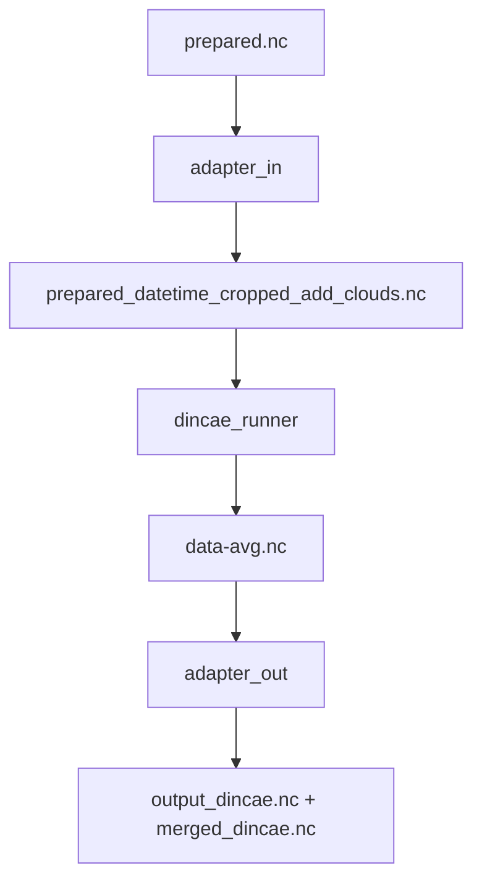

# DINCAE Arm

Thin adaptor to integrate **DINCAE** into the Lake CCI LSWT gap‑filling pipeline.

---

## Purpose

Reuses DINCAE preprocessing and wraps the Julia runner so that DINCAE outputs the same NetCDF structure as DINEOF.  
This allows the existing postprocessor (`dineof_postprocessor`) to run unchanged.

---

## Files

| File | Purpose |
|------|----------|
| `contracts.py` | Data classes (`PreparedNC`, `DincaeArtifacts`) |
| `dincae_adapter_in.py` | Convert `prepared.nc` → datetime, crop, CV datasets |
| `dincae_runner.py` | Launch Julia DINCAE (local or Slurm) |
| `dincae_adapter_out.py` | Map prediction back to full grid/time and emit `_dincae.nc` |

---

## Typical flow



---

## Configuration keys

All under `dincae` in `experiment_settings.json`:

| Key | Description |
|-----|--------------|
| `epoch` | Base date for integer→datetime conversion |
| `crop.buffer_pixels` | Extra pixels around lake mask |
| `cv.cv_fraction` | Fraction of times masked for CV |
| `train.*` | DINCAE hyperparameters |
| `runner.*` | Julia executable, script, mode (`local`/`slurm`) |
| `slurm.*` | Optional overrides for GPU partition, mem, cpus |
| `post.write_merged` | Produce merged obs+model file |

---

## Example usage

```python
from pathlib import Path
from dincae_arm import PreparedNC, build_inputs, run_dincae, write_dineof_shaped_outputs

cfg = {...}  # loaded JSON section
prepared = PreparedNC(Path("/data/prepared.nc"))
arts = build_inputs(prepared, Path("dincae/00000314/a0100"), cfg)
arts = run_dincae(cfg, arts)
write_dineof_shaped_outputs(arts, prepared, Path("post/00000314/a0100"), "LAKE00000314-...-filled_fine", cfg)
```

Outputs:
```
dincae/.../data-avg.nc
dincae/.../data-avg-full.nc
post/.../LAKE00000314-..._dincae.nc
```

---

## Notes

- Suffix `_dincae` is mandatory for disambiguation.
- Output metadata: `source_model="DINCAE"`, `model_suffix="_dincae"`, `quality_level=5`.
- All coordinates/time align with `prepared.nc`.

---

## License

Part of the Lake CCI gap‑filling pipeline © 2025 Shaerdan & collaborators.
